# InsureConnect — Enterprise SSO Architecture
# 100% Resource Uptime · Minimum Cost · Auth0 B2C · 40K MAU · Azure

## 1. Full SSO System Overview

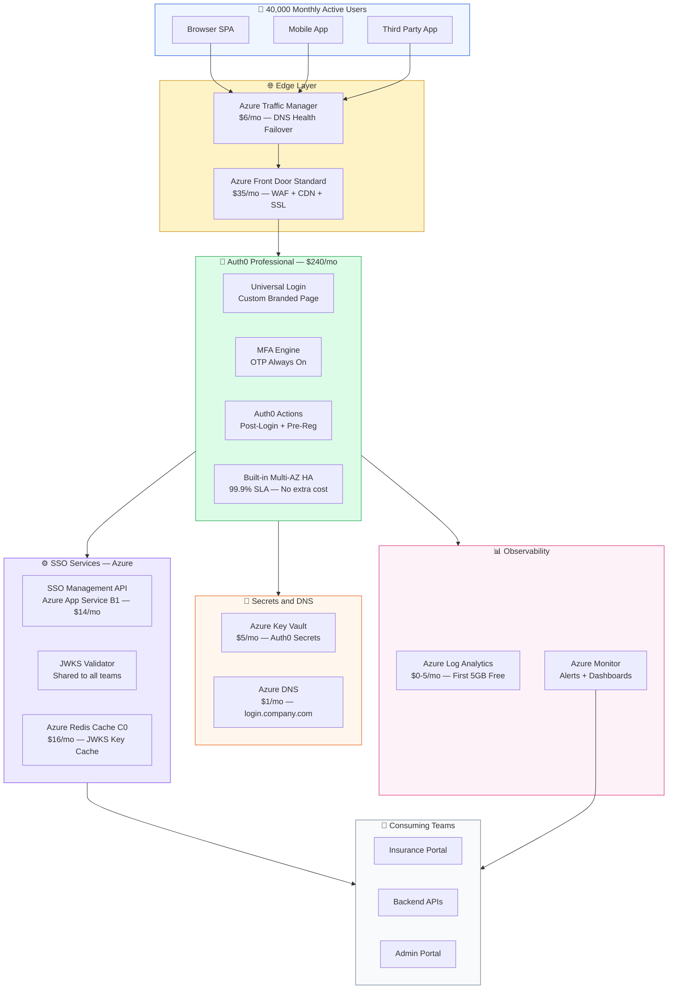

## 2. Active Standby — 100% Uptime Without Dual Tenant Cost

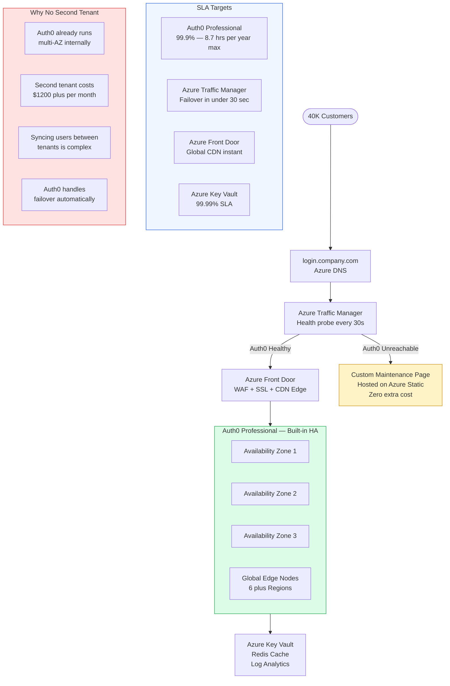

## 3. Azure Services — Keep Remove Downsize

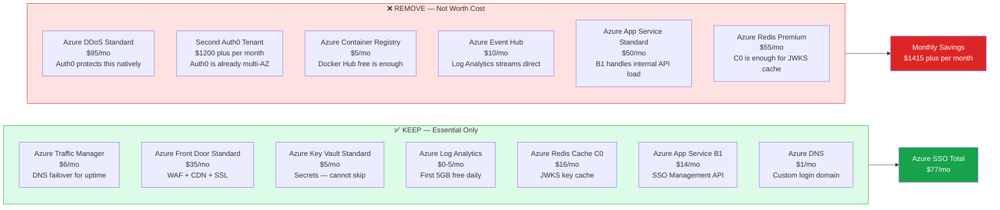

## 4. Auth0 Actions Pipeline

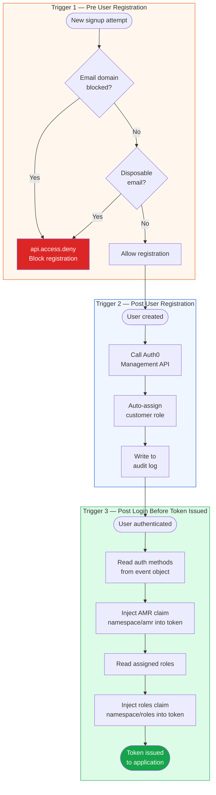

## 5. SSO Management API — What You Build and Own

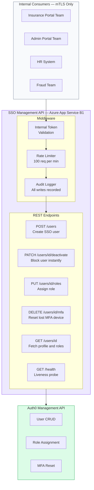

## 6. JWKS Token Validation Flow

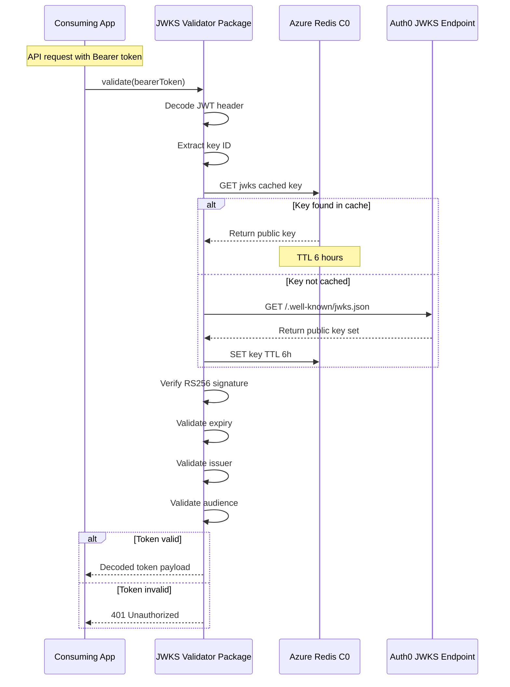

## 7. Log Streaming — Observability Pipeline

```mermaid
flowchart LR
    subgraph SRC ["Auth0 Event Sources"]
        L1[Logins]
        L2[Failed Logins]
        L3[MFA Events]
        L4[Role Changes]
        L5[Anomaly Detected]
    end

    subgraph STREAM ["Auth0 Log Stream\nBuilt-in — No Event Hub Needed"]
        LS[Direct stream\nto Log Analytics]
    end

    subgraph LA2 ["Azure Log Analytics — $0-5/mo"]
        WS[Log Analytics Workspace]
        subgraph KQL ["KQL Alert Rules"]
            Q1[Failed logins\nover 100 per min]
            Q2[MFA failures\nover 50 per min]
            Q3[Impossible travel\ndetected]
            Q4[Admin role\nassigned]
        end
    end

    subgraph NOTIFY ["Azure Monitor Alerts"]
        A1[Teams Channel\nSSO Ops]
        A2[Email\nSecurity Team]
        A3[PagerDuty\nP1 Incident]
    end

    SRC --> STREAM --> WS --> KQL --> NOTIFY

    style SRC fill:#dcfce7,stroke:#16a34a
    style STREAM fill:#eff6ff,stroke:#1a56db
    style LA2 fill:#ede9fe,stroke:#7c3aed
    style NOTIFY fill:#fee2e2,stroke:#dc2626
```

## 8. User Lifecycle — SSO Engineer View

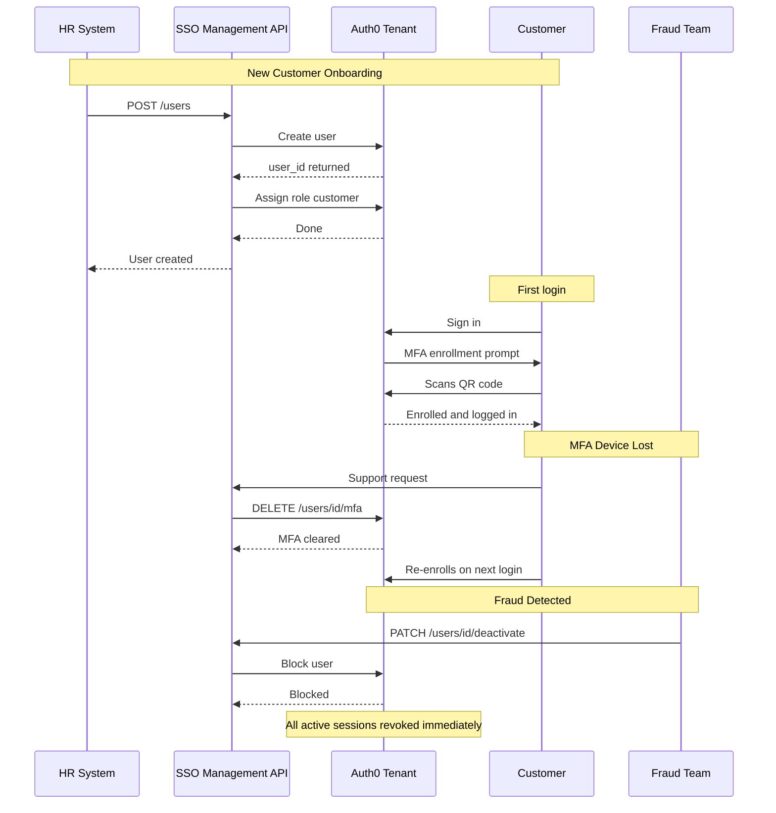

## 9. Security — 5 Layer Defence in Depth

```mermaid
flowchart TD
    INET([Internet\n40K Customers]) --> L1

    subgraph L1 ["Layer 1 — DNS and Traffic"]
        N1[Azure Traffic Manager\nDNS health failover]
        N2[Azure DNS\nlogin.company.com]
    end

    L1 --> L2

    subgraph L2 ["Layer 2 — Edge Protection"]
        E1[Azure Front Door WAF\nOWASP 3.2 rule set]
        E2[Rate Limiting\n200 req per IP per min]
        E3[TLS 1.3 only\nHTTP to HTTPS redirect]
    end

    L2 --> L3

    subgraph L3 ["Layer 3 — Auth0 Identity"]
        I1[Brute Force Protection\nBlock after 10 failures]
        I2[Anomaly Detection\nImpossible travel and bot]
        I3[Breached Password Detection]
        I4[MFA Always On\nOTP every login]
        I5[PKCE Flow\nNo client secret exposed]
    end

    L3 --> L4

    subgraph L4 ["Layer 4 — Token Security"]
        T1[RS256 Signed JWT\nAsymmetric keys only]
        T2[Memory only storage\nNo localStorage]
        T3[Refresh token rotation\nAuto revoke on reuse]
        T4[1 hour ID token expiry]
    end

    L4 --> L5

    subgraph L5 ["Layer 5 — Application"]
        A1[ProtectedRoute RBAC\nRole check per route]
        A2[X-Frame-Options DENY\nClickjacking blocked]
        A3[CSP Headers\nNo iframe embedding]
    end

    style L1 fill:#fef3c7,stroke:#ca8a04
    style L2 fill:#fee2e2,stroke:#dc2626
    style L3 fill:#dcfce7,stroke:#16a34a
    style L4 fill:#dbeafe,stroke:#1a56db
    style L5 fill:#ede9fe,stroke:#7c3aed
```

## 10. Cost Comparison and Scaling

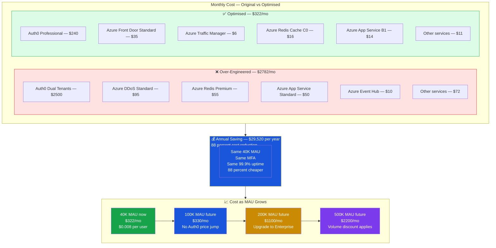

## 11. SSO Team Ownership

```mermaid
flowchart LR
    subgraph OWN2 ["✅ SSO Team Owns"]
        O1[Auth0 Tenant Configuration]
        O2[Auth0 Actions — 3 actions]
        O3[Custom Login Domain]
        O4[Azure Front Door + WAF]
        O5[Azure Traffic Manager]
        O6[Azure Key Vault — Secrets]
        O7[SSO Management API]
        O8[JWKS Validator Package]
        O9[Log Streaming Pipeline]
        O10[Terraform IaC]
        O11[MFA Policy Enforcement]
        O12[RBAC Role Definitions]
    end

    subgraph GIVE ["📦 SSO Team Provides"]
        P1[JWKS npm package]
        P2[Management API endpoints]
        P3[Role assignment docs]
        P4[Token claim schema]
    end

    subgraph NOTOWN ["❌ Other Teams Own"]
        N1[Insurance Portal App]
        N2[Backend APIs]
        N3[Admin Portal UI]
        N4[Business Logic]
        N5[Application Hosting]
    end

    OWN2 --> GIVE --> NOTOWN

    style OWN2 fill:#dcfce7,stroke:#16a34a
    style GIVE fill:#dbeafe,stroke:#1a56db
    style NOTOWN fill:#fee2e2,stroke:#dc2626
```
