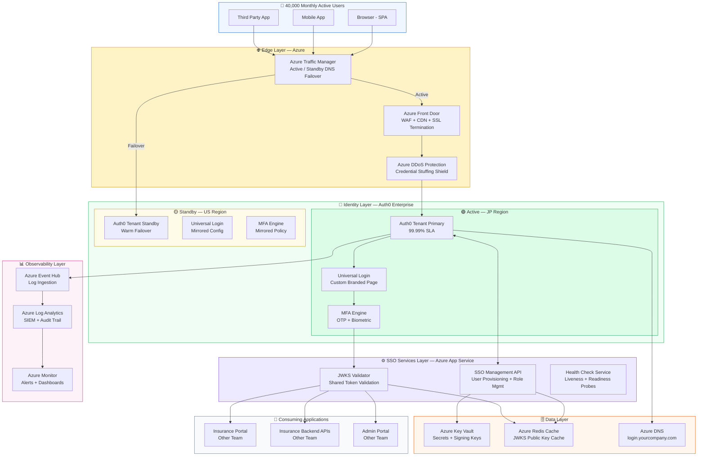
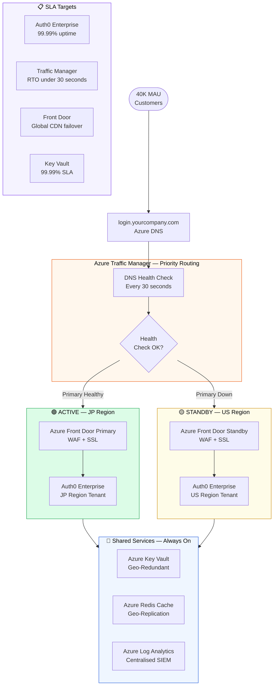
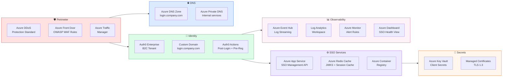
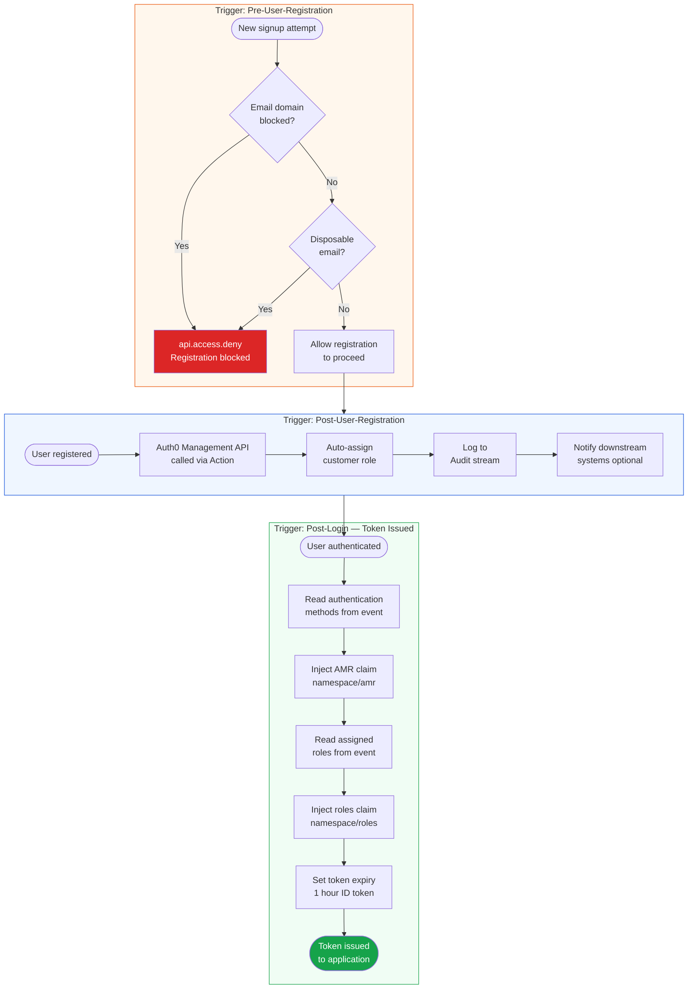
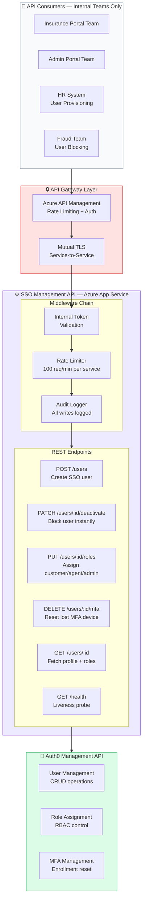
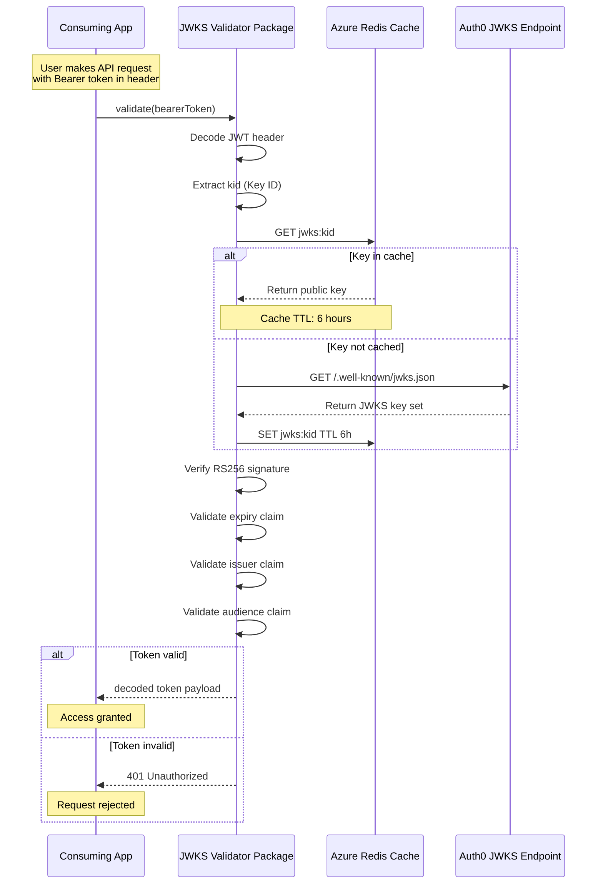
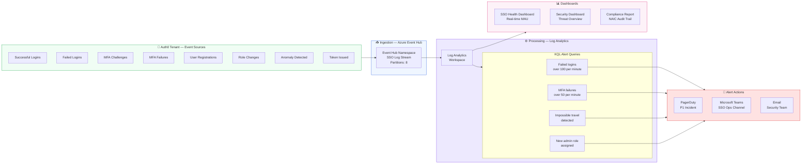
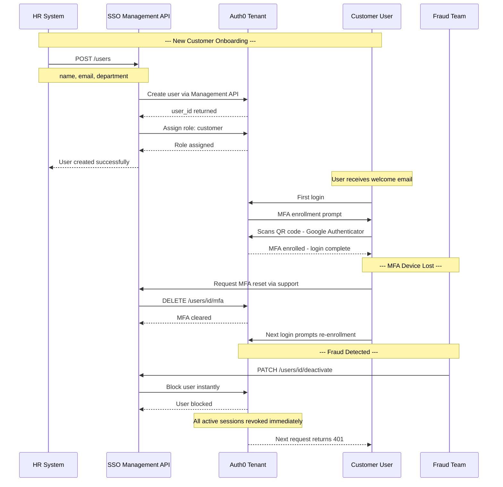

# InsureConnect — Enterprise SSO Architecture

## 1. Enterprise SSO — Full System Overview

## 2. Active / Standby — High Availability Design

## 3. Azure SSO Services Stack

## 4. Auth0 Actions Pipeline

## 5. SSO Management API — Service Architecture

## 6. JWKS Token Validation Flow

## 7. Auth0 Log Streaming — Observability Pipeline

## 8. User Lifecycle — SSO Perspective

## 9. Security Perimeter — Defence in Depth

```mermaid
flowchart TD
    INTERNET([Internet\n40K MAU Customers]) --> L1

    subgraph L1 ["Layer 1 — DDoS + DNS"]
        DL1[Azure DDoS Protection Standard]
        DL2[Azure Traffic Manager\nActive Standby DNS]
        DL3[Azure DNS\nlogin.company.com]
    end

    L1 --> L2

    subgraph L2 ["Layer 2 — Edge Security"]
        EL1[Azure Front Door\nGlobal CDN Points of Presence]
        EL2[WAF Policy\nOWASP 3.2 Rule Set]
        EL3[Rate Limiting\n200 requests per IP per minute]
        EL4[Geo-Blocking\nOptional country rules]
    end

    L2 --> L3

    subgraph L3 ["Layer 3 — Auth0 Identity Security"]
        IL1[Brute Force Protection\nBlock after 10 failures]
        IL2[Anomaly Detection\nImpossible travel + bot]
        IL3[Breached Password\nDetection enabled]
        IL4[MFA Always-On\nOTP every login]
        IL5[PKCE Flow\nNo client secret in browser]
    end

    L3 --> L4

    subgraph L4 ["Layer 4 — Token Security"]
        TL1[RS256 Signed JWT\nAsymmetric keys only]
        TL2[Memory-only storage\nNo localStorage]
        TL3[Refresh token rotation\nAuto-revoke on reuse]
        TL4[1 hour expiry\nShort-lived tokens]
        TL5[Audience validation\nStrict issuer check]
    end

    L4 --> L5

    subgraph L5 ["Layer 5 — Application Security"]
        AL1[ProtectedRoute RBAC\nRole check per route]
        AL2[X-Frame-Options DENY\nClickjacking blocked]
        AL3[CSP Headers\nNo iframe embedding]
        AL4[HTTPS Only\nTLS 1.3 enforced]
    end

    style L1 fill:#fef3c7,stroke:#ca8a04
    style L2 fill:#fee2e2,stroke:#dc2626
    style L3 fill:#ede9fe,stroke:#7c3aed
    style L4 fill:#dbeafe,stroke:#1a56db
    style L5 fill:#dcfce7,stroke:#16a34a
    style INTERNET fill:#f1f5f9,stroke:#64748b
```

## 10. SSO Team Responsibility Matrix

```mermaid
flowchart LR
    subgraph OWN ["✅ SSO Team Owns"]
        O1[Auth0 Tenant Config]
        O2[Auth0 Actions - 3 actions]
        O3[Custom Login Domain\nlogin.company.com]
        O4[Azure Front Door + WAF]
        O5[Azure Traffic Manager\nActive Standby]
        O6[Azure Key Vault\nAll SSO Secrets]
        O7[SSO Management API\nUser + Role Provisioning]
        O8[JWKS Validator Package\nShared to all teams]
        O9[Log Streaming Pipeline\nAuth0 to Azure Monitor]
        O10[Terraform IaC\nAll SSO infrastructure]
        O11[Auth0 MFA Policy\nOTP enforcement]
        O12[RBAC Role Definitions\ncustomer, agent, admin]
    end

    subgraph PROVIDE ["📦 SSO Team Provides to Others"]
        P1[JWKS Validator npm package]
        P2[SSO Management API endpoints]
        P3[Role assignment process]
        P4[Auth0 tenant documentation]
        P5[Token claim schema]
    end

    subgraph NOTOWN ["❌ SSO Team Does NOT Own"]
        N1[Insurance Portal App]
        N2[Insurance Backend APIs]
        N3[Admin Portal UI]
        N4[Business Logic]
        N5[Database - User Data]
        N6[Application Hosting]
    end

    OWN --> PROVIDE
    PROVIDE --> NOTOWN

    style OWN fill:#dcfce7,stroke:#16a34a
    style PROVIDE fill:#dbeafe,stroke:#1a56db
    style NOTOWN fill:#fee2e2,stroke:#dc2626
```

