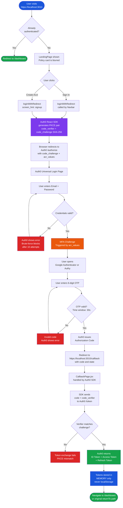
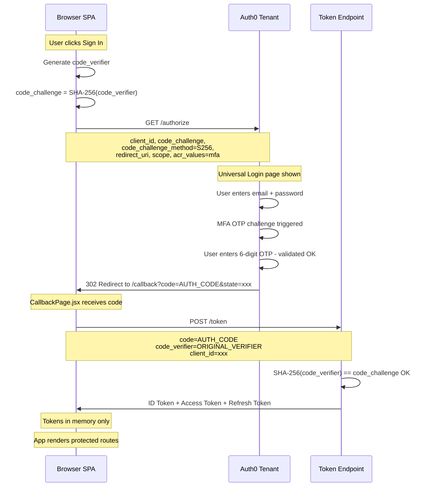
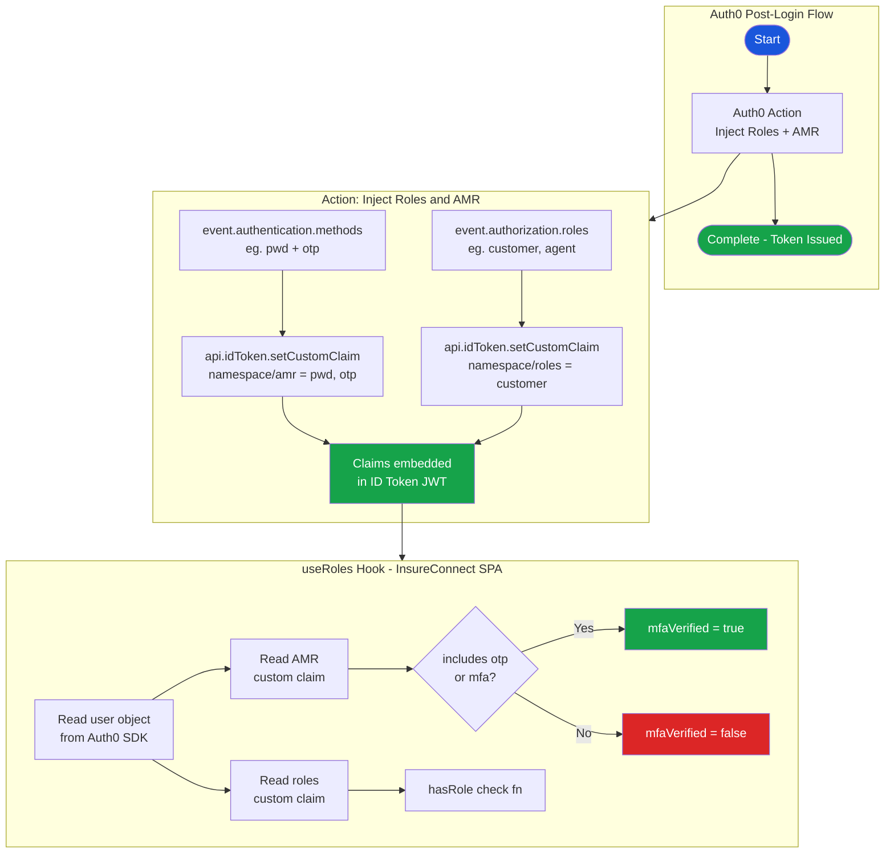
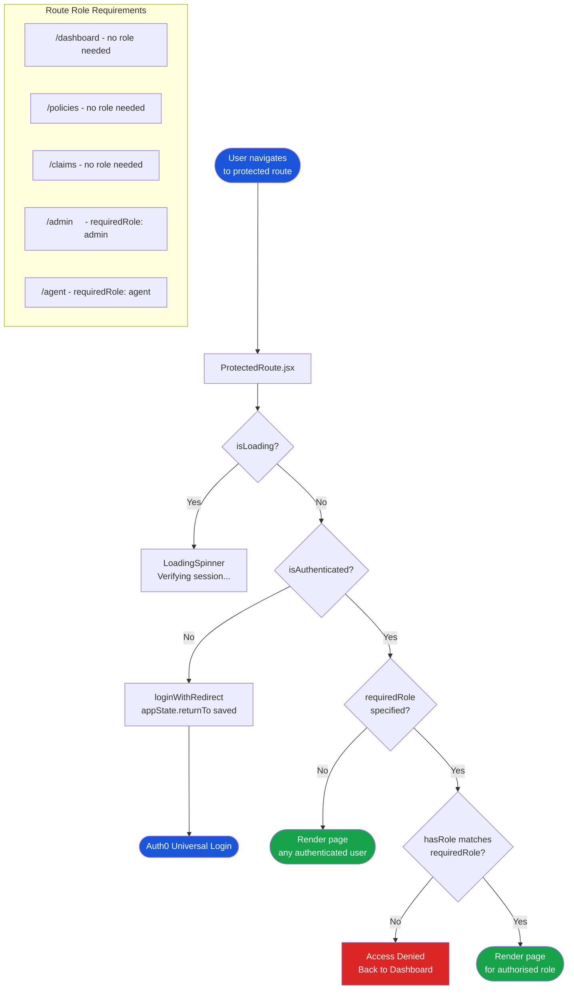
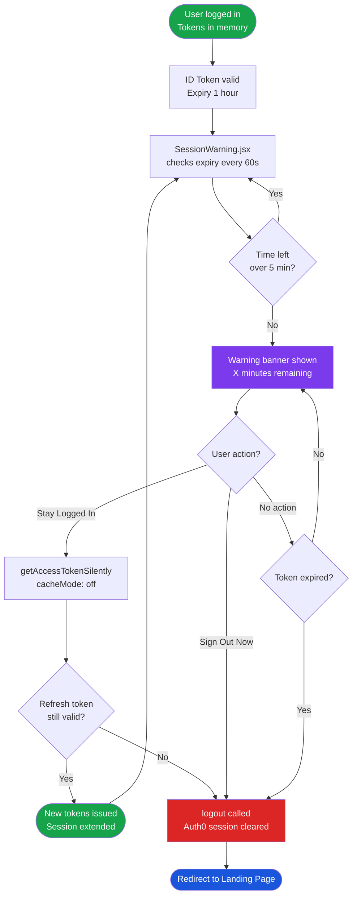
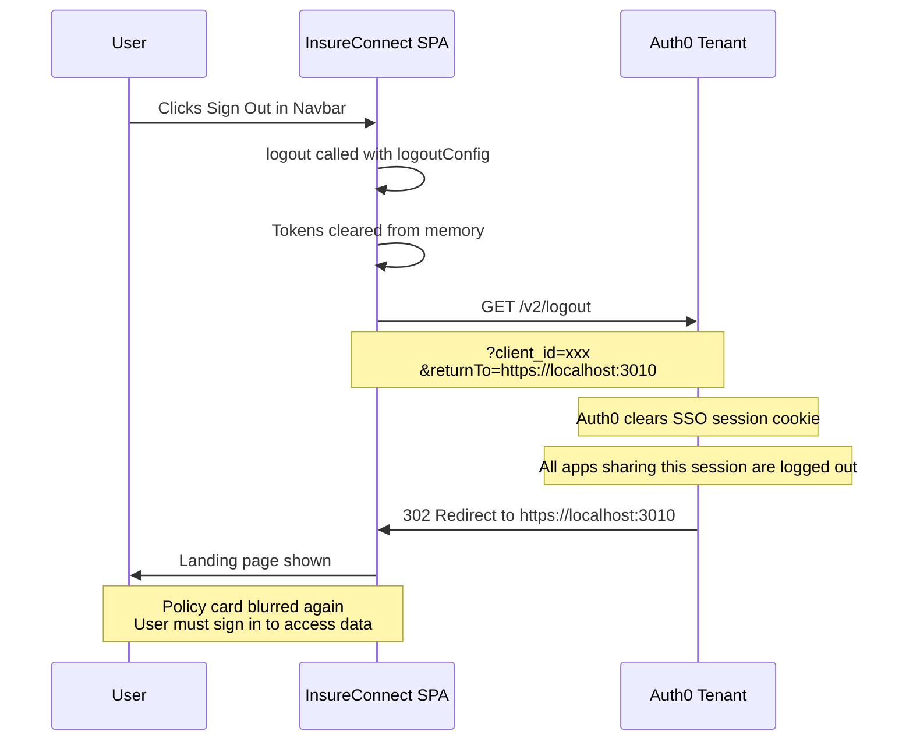
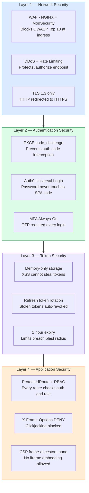

# InsureConnect — SSO + MFA Diagrams

## 1. Complete SSO Login Flow

## 2. PKCE Sequence

## 3. MFA Authentication Flow

```mermaid
flowchart LR
    subgraph AUTH0 ["Auth0 MFA Engine"]
        M1[acr_values received from SPA] --> M2[MFA Policy Always-On]
        M2 --> M3{User has\nMFA enrolled?}
        M3 -- No  --> M4[Show QR Code\nEnrollment Screen]
        M4 --> M5[User scans with\nGoogle Authenticator or Authy]
        M5 --> M6[MFA device\nregistered in Auth0]
        M6 --> M7[OTP Challenge shown]
        M3 -- Yes --> M7
        M7 --> M8[User enters 6-digit code]
        M8 --> M9{Valid?\nTime window 30s}
        M9 -- No  --> M8
        M9 -- Yes --> M10[AMR claim set\nmfa + otp in token]
    end

    subgraph APP ["InsureConnect SPA"]
        A1[useRoles hook\nreads AMR claim] --> A2{mfaVerified?}
        A2 -- Yes --> A3[MFA Verified badge\nshown in Profile]
        A2 -- No  --> A4[Warning shown\nEnable MFA button]
    end

    M10 --> A1

    style AUTH0 fill:#f0fdf4,stroke:#16a34a
    style APP fill:#eff6ff,stroke:#1a56db
    style M10 fill:#16a34a,color:#fff
    style A3 fill:#16a34a,color:#fff
    style A4 fill:#ea580c,color:#fff
```

## 4. Auth0 Action — Token Claim Injection

## 5. RBAC Route Protection

## 6. Session Lifecycle — Token Expiry and Silent Refresh

## 7. Logout Flow

## 8. Security Layers — Defence in Depth

