# Insurance Company — SSO Architecture
### OAuth 2.0 + Keycloak + Azure AD | Department-Based Dynamic Permissions
**Version:** 1.0 | **Audience:** Architects, Engineering Leads, IT Security, Stakeholders

---

## Table of Contents
1. [Executive Overview](#1-executive-overview)
2. [Full System Architecture](#2-full-system-architecture)
3. [OAuth 2.0 + OIDC Complete Flow](#3-oauth-20--oidc-complete-flow)
4. [Azure AD + Keycloak Federation](#4-azure-ad--keycloak-federation)
5. [Insurance Departments & Applications](#5-insurance-departments--applications)
6. [Dynamic Role & Permission Model](#6-dynamic-role--permission-model)
7. [Department Access Matrix](#7-department-access-matrix)
8. [Token Flow — What Each Layer Sees](#8-token-flow--what-each-layer-sees)
9. [User Lifecycle — Hire to Retire](#9-user-lifecycle--hire-to-retire)
10. [Security Layers](#10-security-layers)
11. [Hidden Flows You Must Know](#11-hidden-flows-you-must-know)
12. [Production Checklist](#12-production-checklist)

---

## 1. Executive Overview

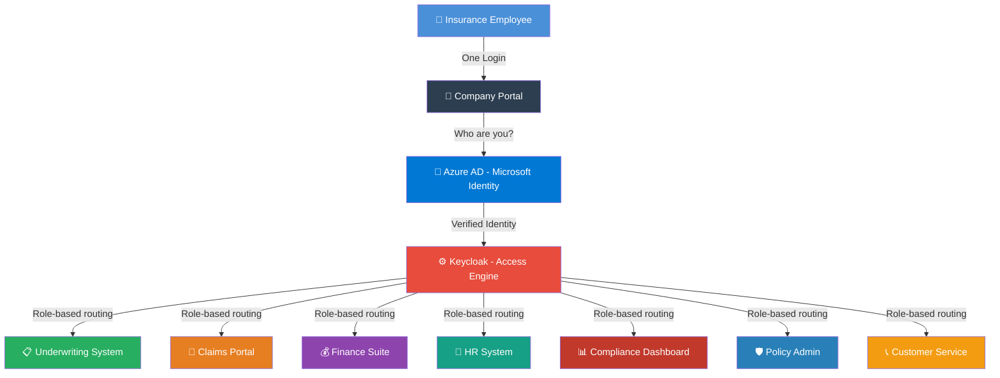

**The Core Principle:**
> Azure AD answers **"Is this a real company employee?"**
> Keycloak answers **"Which insurance systems can they access?"**
> Apps answer **"What can they do inside this system?"**

---

## 2. Full System Architecture

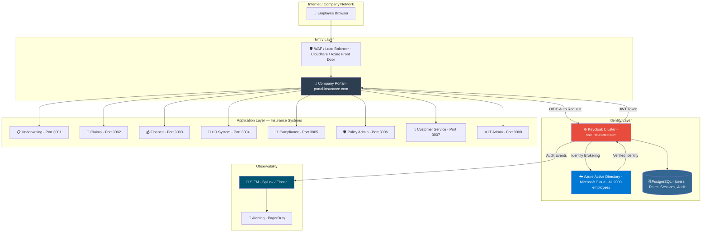

---

## 3. OAuth 2.0 + OIDC Complete Flow

### Authorization Code Flow — What happens when employee logs in

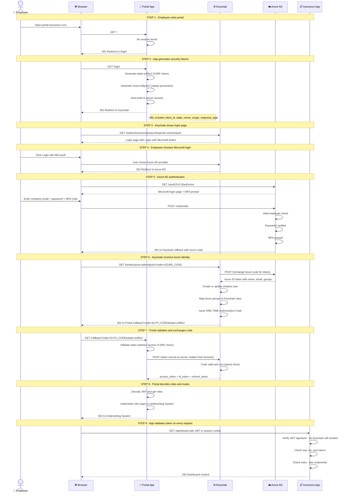

---

## 4. Azure AD + Keycloak Federation

### How Identity Flows from Microsoft to Your Apps

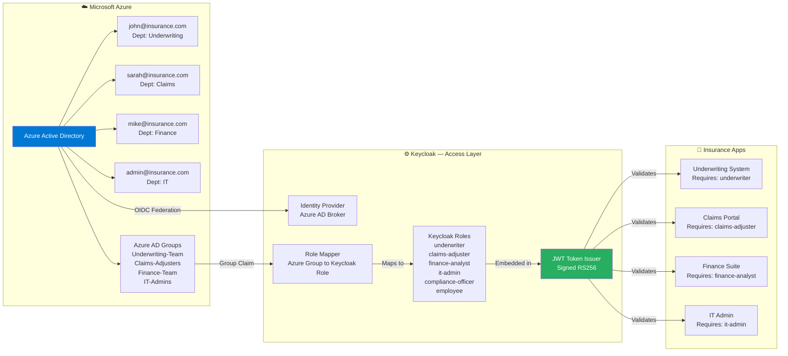

### What Keycloak Receives from Azure AD vs What It Issues

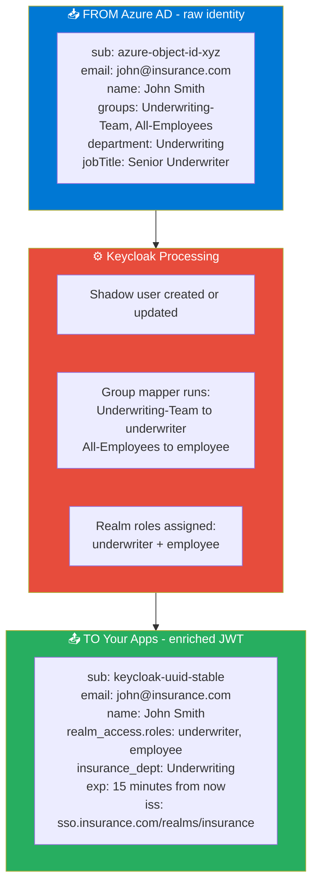

---

## 5. Insurance Departments & Applications

```mermaid
graph TD
    subgraph DEPT["🏢 Insurance Company Departments"]
        UW_DEPT["📋 Underwriting<br/>Assess risk, approve policies"]
        CL_DEPT["🏥 Claims<br/>Process and settle claims"]
        FIN_DEPT["💰 Finance and Actuarial<br/>Pricing, reserves, reporting"]
        HR_DEPT["👥 Human Resources<br/>People, payroll, hiring"]
        COMP_DEPT["📊 Compliance and Legal<br/>Regulatory, audits, GDPR"]
        POL_DEPT["🛡️ Policy Administration<br/>Policy lifecycle management"]
        CS_DEPT["📞 Customer Service<br/>Agent and customer support"]
        IT_DEPT["⚙️ IT and DevOps<br/>Systems, security, infra"]
    end

    subgraph SYS["💻 Insurance Applications"]
        UW_APP["Underwriting System<br/>Risk scoring, quote approval"]
        CL_APP["Claims Portal<br/>FNOL, adjuster workflow"]
        FIN_APP["Finance Suite<br/>Ledger, actuarial models"]
        HR_APP["HR System<br/>People management"]
        COMP_APP["Compliance Dashboard<br/>Audit trails, reports"]
        POL_APP["Policy Admin System<br/>Policy CRUD, endorsements"]
        CS_APP["Customer Service Portal<br/>Tickets, policy lookup"]
        ADMIN_APP["IT Admin Dashboard<br/>All systems monitoring"]
        DOCS["Document Portal<br/>All staff — read only"]
    end

    UW_DEPT -->|underwriter role| UW_APP
    CL_DEPT -->|claims-adjuster role| CL_APP
    FIN_DEPT -->|finance-analyst role| FIN_APP
    HR_DEPT -->|hr-manager role| HR_APP
    COMP_DEPT -->|compliance-officer role| COMP_APP
    POL_DEPT -->|policy-admin role| POL_APP
    CS_DEPT -->|customer-service role| CS_APP
    IT_DEPT -->|it-admin role| ADMIN_APP
    ALL["All Employees<br/>employee role"] -->|read access| DOCS

    style UW_DEPT fill:#27ae60,color:#fff
    style CL_DEPT fill:#e67e22,color:#fff
    style FIN_DEPT fill:#8e44ad,color:#fff
    style HR_DEPT fill:#16a085,color:#fff
    style COMP_DEPT fill:#c0392b,color:#fff
    style POL_DEPT fill:#2980b9,color:#fff
    style CS_DEPT fill:#f39c12,color:#fff
    style IT_DEPT fill:#7f8c8d,color:#fff
```

---

## 6. Dynamic Role & Permission Model

### How Permissions Are Checked on Every Request

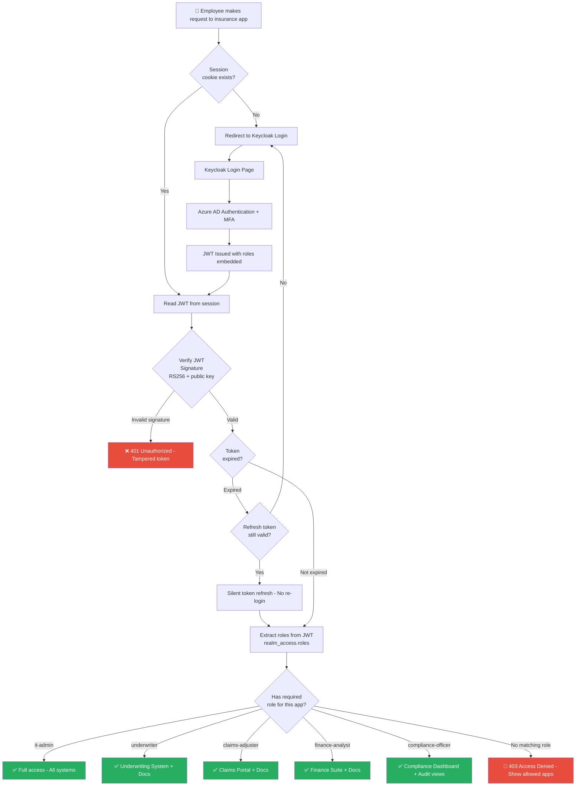

### Role Hierarchy for Insurance

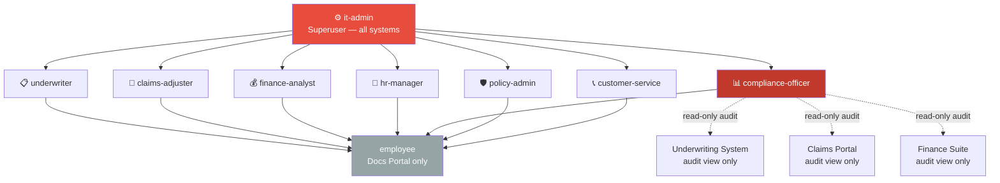

---

## 7. Department Access Matrix

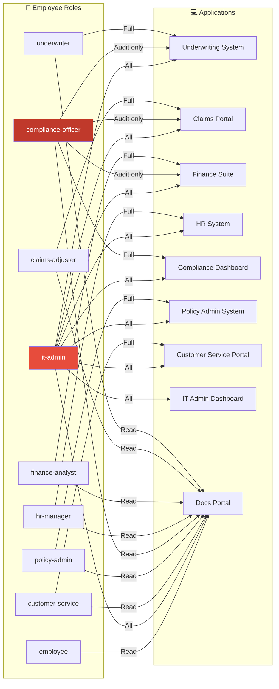

---

## 8. Token Flow — What Each Layer Sees

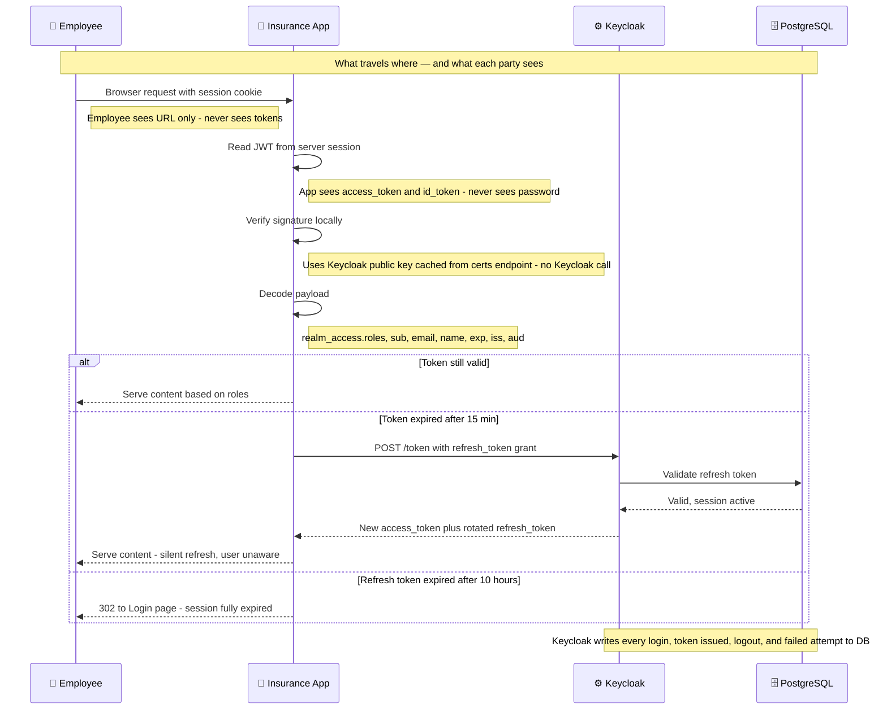

### JWT Token Structure — Decoded

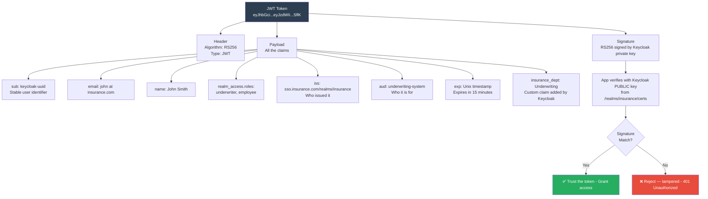

---

## 9. User Lifecycle — Hire to Retire

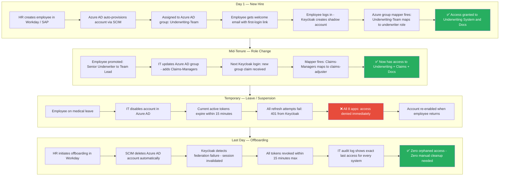

---

## 10. Security Layers

```mermaid
graph TD
    subgraph L1["Layer 1 — Network"]
        WAF["WAF and DDoS Protection<br/>Cloudflare / Azure Front Door"]
        TLS["TLS 1.3<br/>All traffic encrypted"]
        IP["IP Allowlisting<br/>for admin endpoints"]
    end

    subgraph L2["Layer 2 — Identity via Azure AD"]
        MFA["MFA Enforcement<br/>Microsoft Authenticator"]
        CA["Conditional Access<br/>Block unknown countries"]
        RISK["Risk-based Auth<br/>Anomaly detection - Microsoft Defender"]
        PWD["Password Policy<br/>12+ chars, breach detection"]
    end

    subgraph L3["Layer 3 — Access via Keycloak"]
        BRUTE["Brute Force Protection<br/>5 fails locks account"]
        TOKEN_EXP["Token Expiry<br/>15 min access / 10 hr refresh"]
        ROTATE["Refresh Token Rotation<br/>Reuse detection"]
        SIGN["RS256 Signing<br/>2048-bit RSA keys, 90-day rotation"]
    end

    subgraph L4["Layer 4 — Application"]
        ROLE["Role Check on every request"]
        SCOPE["Scope Validation - aud claim check"]
        CLAIM["Custom Claims<br/>dept and clearance level"]
    end

    subgraph L5["Layer 5 — Audit"]
        LOG["Centralised Audit Log<br/>Every login, logout, fail"]
        ALERT["Real-time Alerts<br/>Suspicious patterns"]
        REPORT["Compliance Reports<br/>Who accessed what and when"]
    end

    L1 --> L2 --> L3 --> L4 --> L5

    style L1 fill:#2c3e50,color:#fff
    style L2 fill:#0078d4,color:#fff
    style L3 fill:#e74c3c,color:#fff
    style L4 fill:#27ae60,color:#fff
    style L5 fill:#8e44ad,color:#fff
```

### Threat Model

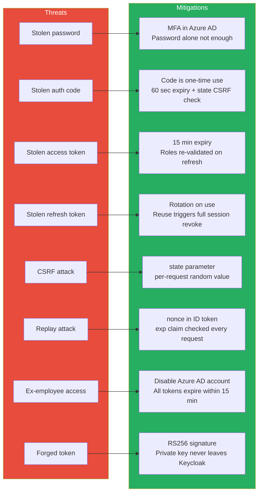

---

## 11. Hidden Flows You Must Know

### Flow 1 — Silent Token Refresh (Invisible to User)

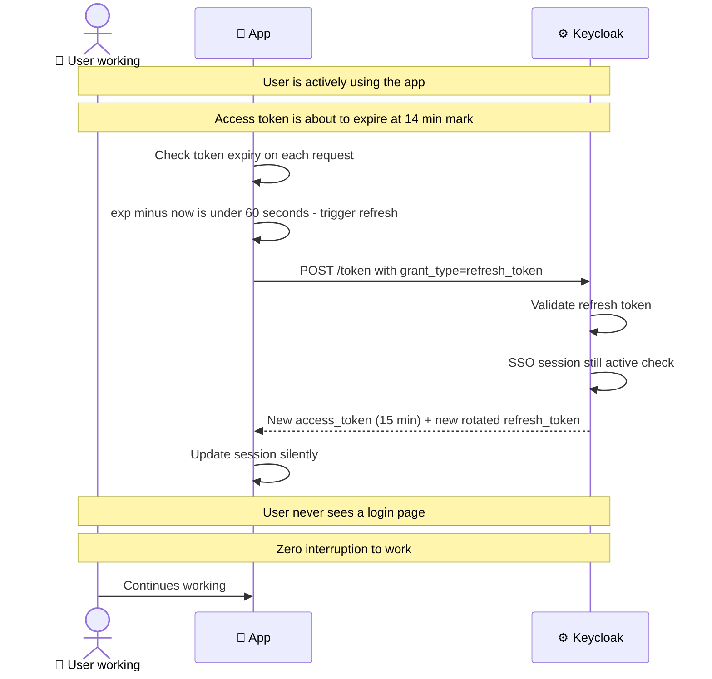

### Flow 2 — Concurrent Sessions (Same User, Multiple Devices)

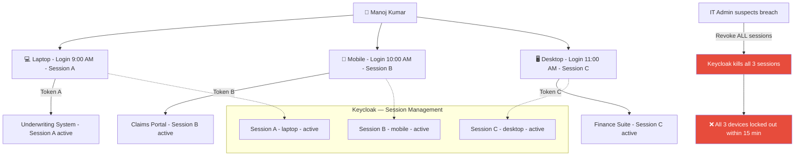

### Flow 3 — Compliance Officer Cross-System Audit Access

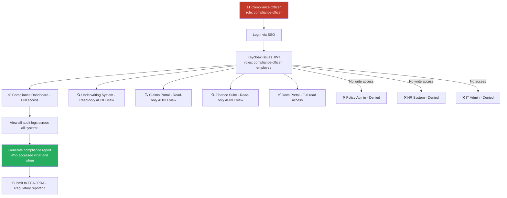

### Flow 4 — Broker / External Partner Access

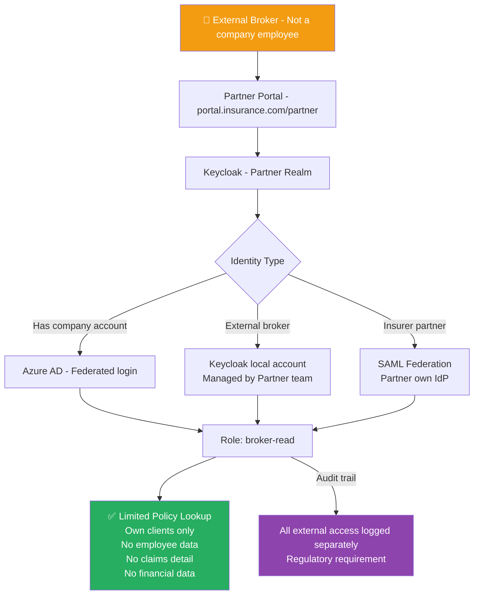

### Flow 5 — Emergency Break-Glass Access

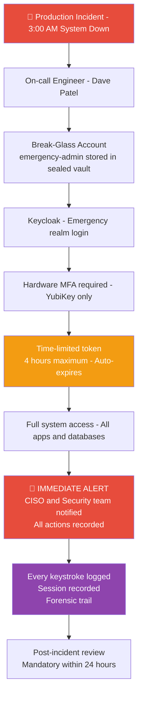

---

## 12. Production Checklist

```mermaid
graph TD
    subgraph P1["Phase 1 — Security Hardening"]
        S1["✅ HTTPS everywhere - TLS 1.3 only"]
        S2["✅ Keycloak production mode - not start-dev"]
        S3["✅ Secrets in Vault - not .env files"]
        S4["✅ DB encrypted at rest - Azure Managed Disks"]
        S5["✅ Token expiry tuned - 15 min access / 10 hr refresh"]
    end

    subgraph P2["Phase 2 — Reliability"]
        R1["✅ Keycloak cluster - 3 nodes minimum"]
        R2["✅ PostgreSQL HA - read replicas and failover"]
        R3["✅ Redis for sessions - not in-memory"]
        R4["✅ Health checks on all containers"]
        R5["✅ Backup strategy - realm export daily"]
    end

    subgraph P3["Phase 3 — Compliance"]
        C1["✅ Audit logging to SIEM - Splunk or Elastic"]
        C2["✅ Access reviews - quarterly automated"]
        C3["✅ MFA enforced for all roles"]
        C4["✅ Data residency - EU only if required"]
        C5["✅ GDPR - user data export and delete API"]
    end

    subgraph P4["Phase 4 — Automation"]
        A1["✅ SCIM provisioning - HR to Azure AD to Keycloak"]
        A2["✅ Role assignment API - auto-assign on department join"]
        A3["✅ Orphan account scan - weekly automated job"]
        A4["✅ Certificate rotation - RS256 keys every 90 days"]
        A5["✅ Penetration testing - annual OAuth flow audit"]
    end

    P1 --> P2 --> P3 --> P4

    style P1 fill:#e74c3c,color:#fff
    style P2 fill:#e67e22,color:#fff
    style P3 fill:#8e44ad,color:#fff
    style P4 fill:#27ae60,color:#fff
```

---

## Quick Reference — Insurance SSO at a Glance

```mermaid
graph LR
    subgraph WHO["WHO are you?"]
        AAD["Azure AD<br/>Microsoft-managed<br/>Password and MFA"]
    end

    subgraph WHAT["WHAT can you do?"]
        KC["Keycloak<br/>Your team manages<br/>Roles and Routing"]
    end

    subgraph WHERE["WHERE do you go?"]
        APPS["Insurance Apps<br/>Role-gated<br/>JWT verified"]
    end

    subgraph TRACK["TRACK everything"]
        AUDIT["Audit Logs<br/>Every access<br/>Compliance ready"]
    end

    WHO -->|Verified identity| WHAT
    WHAT -->|Signed JWT token| WHERE
    WHERE -->|All events| TRACK

    style WHO fill:#0078d4,color:#fff
    style WHAT fill:#e74c3c,color:#fff
    style WHERE fill:#27ae60,color:#fff
    style TRACK fill:#8e44ad,color:#fff
```

---

*Document Series:*
*[SSO-ARCHITECTURE.md](SSO-ARCHITECTURE.md) | [OIDC-EXPLAINED.md](OIDC-EXPLAINED.md) | [AZURE-AD-SETUP.md](AZURE-AD-SETUP.md)*

*Regulatory references: FCA SYSC 13, PRA SS2/21, ISO 27001 A.9, SOC 2 CC6*
