# Insurance Company — SSO Architecture
### OAuth 2.0 + Keycloak + Azure AD | Department-Based Dynamic Permissions
**Version:** 1.0 | **Audience:** Architects, Engineering Leads, IT Security, Stakeholders

---

## Table of Contents
1. [Executive Overview](#1-executive-overview)
2. [Full System Architecture](#2-full-system-architecture)
3. [OAuth 2.0 + OIDC Complete Flow](#3-oauth-20--oidc-complete-flow)
4. [Azure AD + Keycloak Federation](#4-azure-ad--keycloak-federation)
5. [Insurance Departments & Applications](#5-insurance-departments--applications)
6. [Dynamic Role & Permission Model](#6-dynamic-role--permission-model)
7. [Department Access Matrix](#7-department-access-matrix)
8. [Token Flow — What Each Layer Sees](#8-token-flow--what-each-layer-sees)
9. [User Lifecycle — Hire to Retire](#9-user-lifecycle--hire-to-retire)
10. [Security Layers](#10-security-layers)
11. [Hidden Flows You Must Know](#11-hidden-flows-you-must-know)
12. [Production Checklist](#12-production-checklist)

---

## 1. Executive Overview

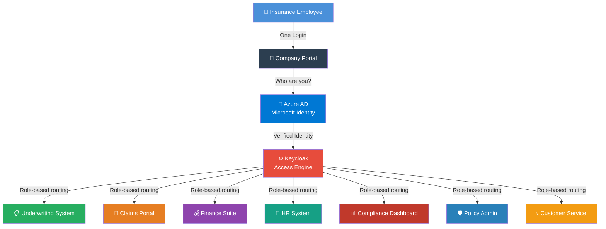

**The Core Principle:**
> Azure AD answers **"Is this a real company employee?"**
> Keycloak answers **"Which insurance systems can they access?"**
> Apps answer **"What can they do inside this system?"**

---

## 2. Full System Architecture

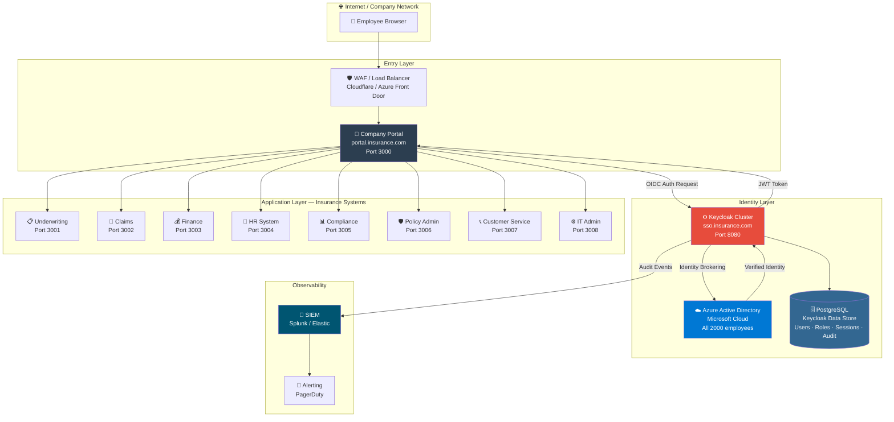

---

## 3. OAuth 2.0 + OIDC Complete Flow

### Authorization Code Flow (What happens when employee logs in)

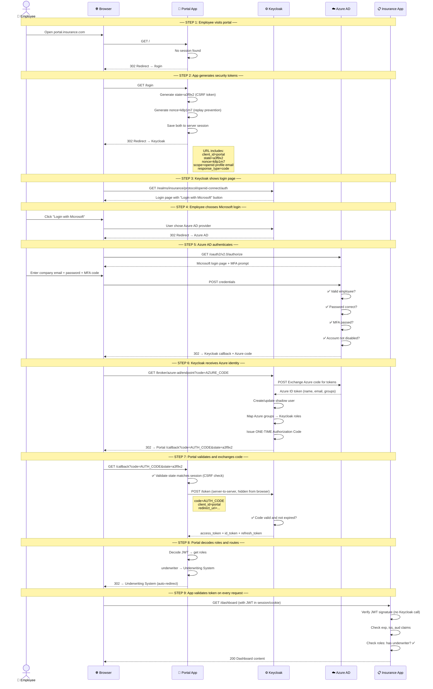

---

## 4. Azure AD + Keycloak Federation

### How Identity Flows from Microsoft to Your Apps

```mermaid
flowchart LR
    subgraph MS["☁️ Microsoft Azure"]
        AAD[Azure Active Directory]
        AAD --> U1[john@insurance.com\nDept: Underwriting]
        AAD --> U2[sarah@insurance.com\nDept: Claims]
        AAD --> U3[mike@insurance.com\nDept: Finance]
        AAD --> U4[admin@insurance.com\nDept: IT]
        AAD --> GRP[Azure AD Groups\nUnderwriting-Team\nClaims-Adjusters\nFinance-Team\nIT-Admins]
    end

    subgraph KC["⚙️ Keycloak — Access Layer"]
        IDP[Identity Provider\nAzure AD Broker]
        MAP[Role Mapper\nAzure Group → Keycloak Role]
        ROLES[Keycloak Roles\nunderwriter\nclaims-adjuster\nfinance-analyst\nit-admin\ncompliance-officer\npolicy-admin\ncustomer-service\nemployee]
        TOKEN[JWT Token Issuer\nSigned RS256]
    end

    subgraph APPS["🏢 Insurance Apps"]
        A1[Underwriting System\nRequires: underwriter]
        A2[Claims Portal\nRequires: claims-adjuster]
        A3[Finance Suite\nRequires: finance-analyst]
        A4[IT Admin\nRequires: it-admin]
    end

    AAD -->|OIDC Federation| IDP
    GRP -->|Group Claim| MAP
    MAP -->|Maps to| ROLES
    ROLES -->|Embedded in| TOKEN
    TOKEN -->|Validates| A1 & A2 & A3 & A4

    style AAD fill:#0078d4,color:#fff
    style KC fill:#e74c3c,color:#fff
    style TOKEN fill:#27ae60,color:#fff
```

### What Keycloak Receives from Azure AD vs What It Issues

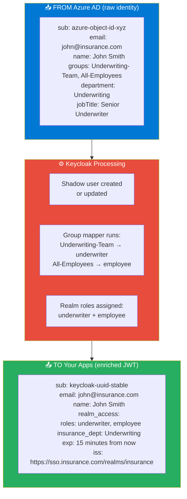

---

## 5. Insurance Departments & Applications

```mermaid
graph TD
    subgraph DEPT["🏢 Insurance Company Departments"]
        UW_DEPT[📋 Underwriting\nAssess risk, approve policies]
        CL_DEPT[🏥 Claims\nProcess & settle claims]
        FIN_DEPT[💰 Finance & Actuarial\nPricing, reserves, reporting]
        HR_DEPT[👥 Human Resources\nPeople, payroll, hiring]
        COMP_DEPT[📊 Compliance & Legal\nRegulatory, audits, GDPR]
        POL_DEPT[🛡️ Policy Administration\nPolicy lifecycle mgmt]
        CS_DEPT[📞 Customer Service\nAgent & customer support]
        IT_DEPT[⚙️ IT & DevOps\nSystems, security, infra]
    end

    subgraph SYS["💻 Insurance Applications"]
        UW_APP[Underwriting System\nRisk scoring, quote approval]
        CL_APP[Claims Portal\nFNOL, adjuster workflow]
        FIN_APP[Finance Suite\nLedger, actuarial models]
        HR_APP[HR System\nPeople management]
        COMP_APP[Compliance Dashboard\nAudit trails, reports]
        POL_APP[Policy Admin System\nPolicy CRUD, endorsements]
        CS_APP[Customer Service Portal\nTickets, policy lookup]
        ADMIN_APP[IT Admin Dashboard\nAll systems monitoring]
        DOCS[Document Portal\nAll staff — read only]
    end

    UW_DEPT -->|underwriter role| UW_APP
    CL_DEPT -->|claims-adjuster role| CL_APP
    FIN_DEPT -->|finance-analyst role| FIN_APP
    HR_DEPT -->|hr-manager role| HR_APP
    COMP_DEPT -->|compliance-officer role| COMP_APP
    POL_DEPT -->|policy-admin role| POL_APP
    CS_DEPT -->|customer-service role| CS_APP
    IT_DEPT -->|it-admin role| ADMIN_APP
    ALL[All Employees\nemployee role] -->|read access| DOCS

    style UW_DEPT fill:#27ae60,color:#fff
    style CL_DEPT fill:#e67e22,color:#fff
    style FIN_DEPT fill:#8e44ad,color:#fff
    style HR_DEPT fill:#16a085,color:#fff
    style COMP_DEPT fill:#c0392b,color:#fff
    style POL_DEPT fill:#2980b9,color:#fff
    style CS_DEPT fill:#f39c12,color:#fff
    style IT_DEPT fill:#7f8c8d,color:#fff
```

---

## 6. Dynamic Role & Permission Model

### How Permissions Are Checked on Every Request

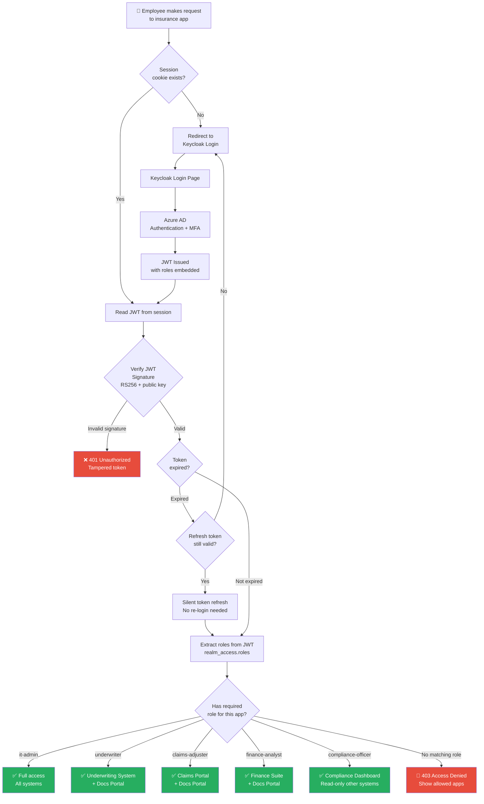

### Role Hierarchy for Insurance

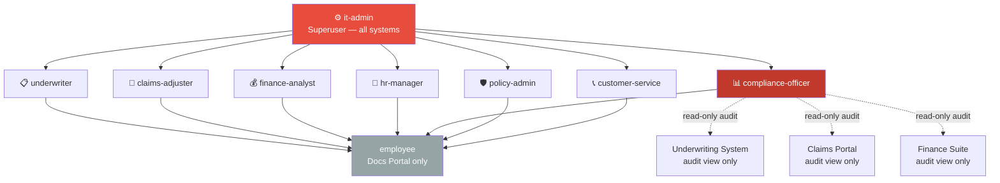

---

## 7. Department Access Matrix

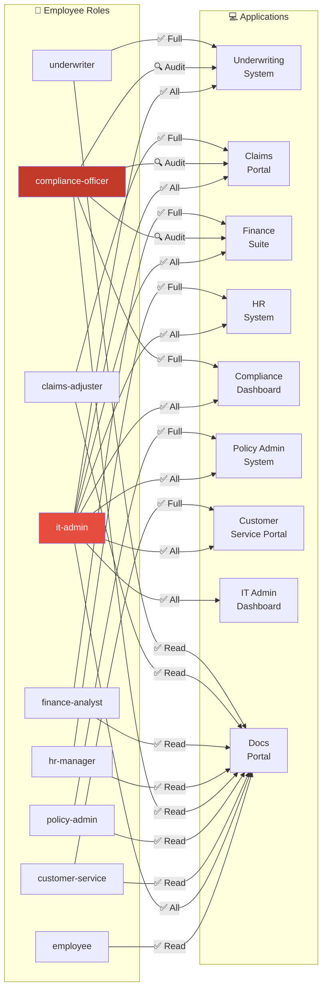

---

## 8. Token Flow — What Each Layer Sees

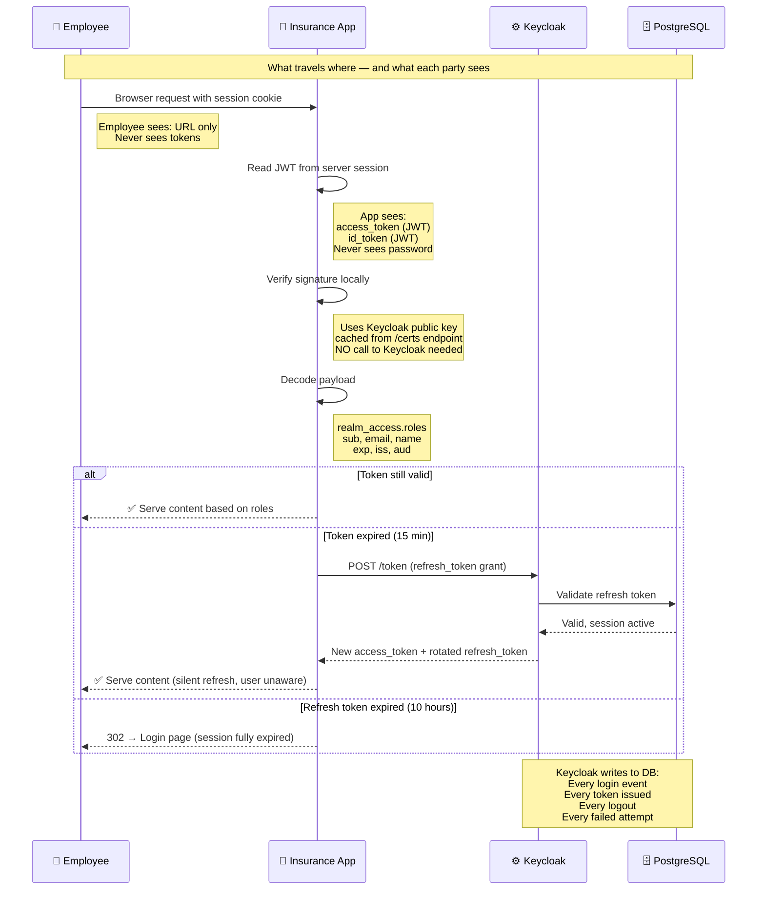

### JWT Token Structure — Decoded

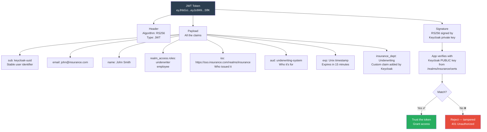

---

## 9. User Lifecycle — Hire to Retire

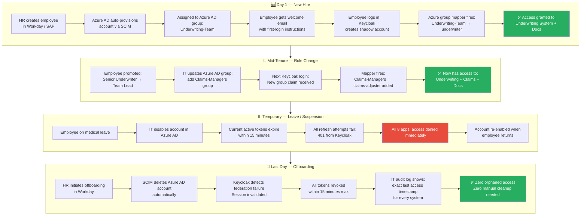

---

## 10. Security Layers

```mermaid
graph TD
    subgraph L1["Layer 1 — Network"]
        WAF[WAF / DDoS Protection\nCloudflare / Azure Front Door]
        TLS[TLS 1.3\nAll traffic encrypted]
        IP[IP Allowlisting\nfor admin endpoints]
    end

    subgraph L2["Layer 2 — Identity - Azure AD"]
        MFA[MFA Enforcement\nMicrosoft Authenticator]
        CA[Conditional Access\nBlock unknown countries]
        RISK[Risk-based Auth\nAnomaly detection\nMicrosoft Defender]
        PWD[Password Policy\n12+ chars, breach detection]
    end

    subgraph L3["Layer 3 — Access - Keycloak"]
        BRUTE[Brute Force Protection\n5 fails → lockout]
        TOKEN_EXP[Token Expiry\n15 min access\n10 hr refresh]
        ROTATE[Refresh Token Rotation\nReuse detection]
        SIGN[RS256 Signing\n2048-bit RSA keys\n90-day rotation]
    end

    subgraph L4["Layer 4 — Application"]
        ROLE[Role Check\nevery request]
        SCOPE[Scope Validation\naud claim check]
        CLAIM[Custom Claims\ndept + clearance level]
    end

    subgraph L5["Layer 5 — Audit"]
        LOG[Centralised Audit Log\nEvery login/logout/fail]
        ALERT[Real-time Alerts\nSuspicious patterns]
        REPORT[Compliance Reports\nWho accessed what + when]
    end

    L1 --> L2 --> L3 --> L4 --> L5

    style L1 fill:#2c3e50,color:#fff
    style L2 fill:#0078d4,color:#fff
    style L3 fill:#e74c3c,color:#fff
    style L4 fill:#27ae60,color:#fff
    style L5 fill:#8e44ad,color:#fff
```

### Threat Model

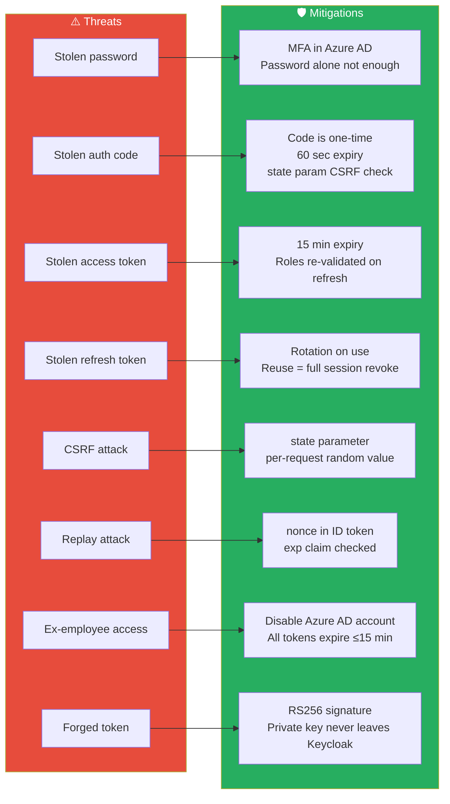

---

## 11. Hidden Flows You Must Know

### Flow 1 — Silent Token Refresh (Invisible to User)

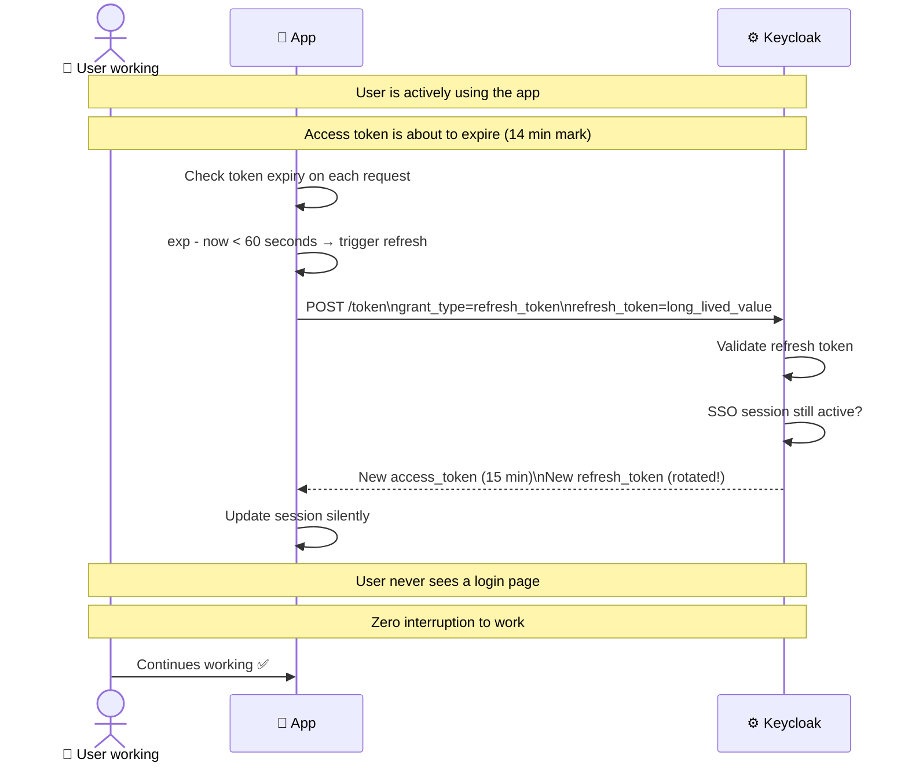

### Flow 2 — Concurrent Sessions (Same User, Multiple Devices)

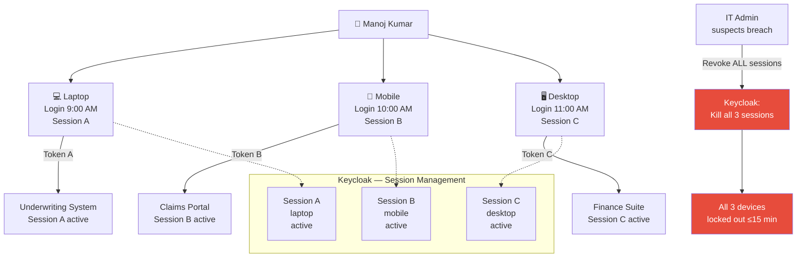

### Flow 3 — Compliance Officer Cross-System Audit Access

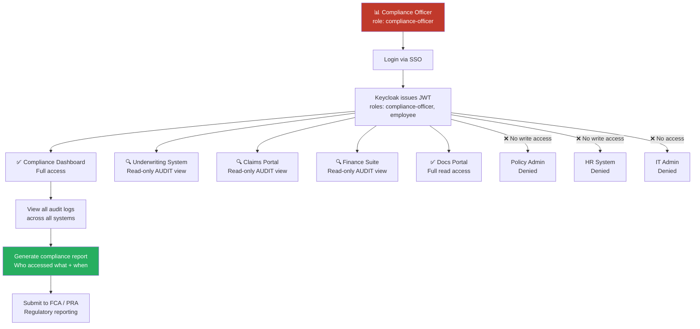

### Flow 4 — Broker / External Partner Access

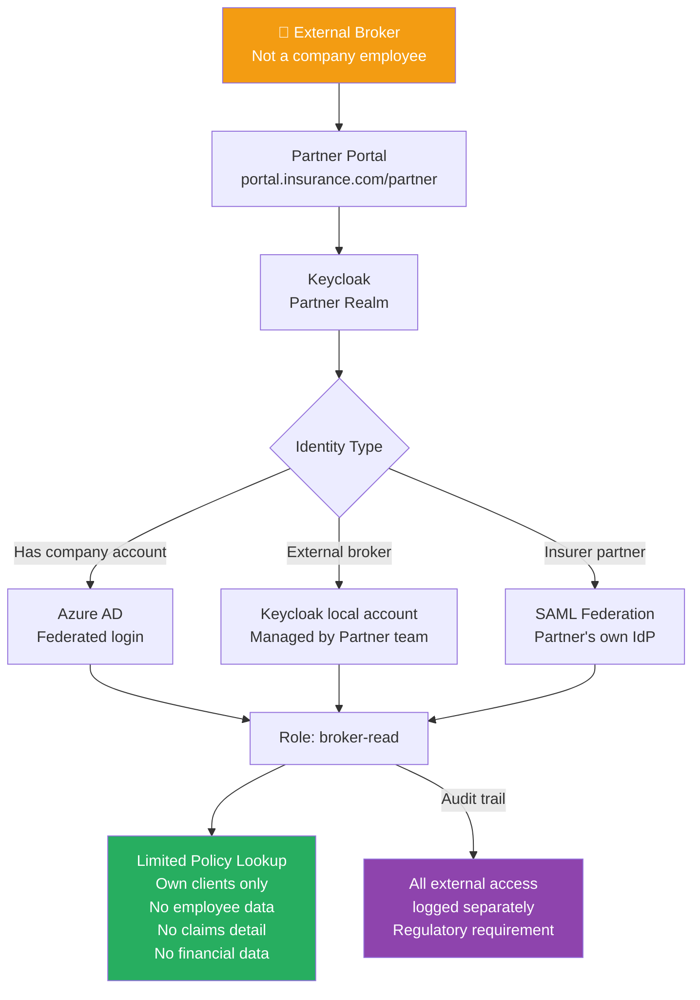

### Flow 5 — Emergency Break-Glass Access

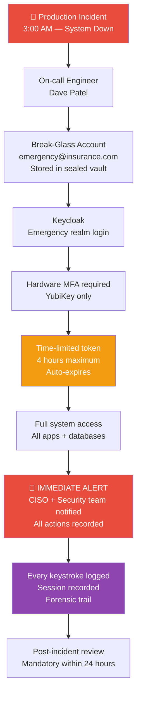

---

## 12. Production Checklist

```mermaid
graph TD
    subgraph P1["Phase 1 — Security Hardening"]
        S1[✅ HTTPS everywhere\nTLS 1.3 only]
        S2[✅ Keycloak production mode\nnot start-dev]
        S3[✅ Secrets in Vault\nnot .env files]
        S4[✅ DB encrypted at rest\nAzure Managed Disks]
        S5[✅ Token expiry tuned\n15 min access / 10 hr refresh]
    end

    subgraph P2["Phase 2 — Reliability"]
        R1[✅ Keycloak cluster\n3 nodes minimum]
        R2[✅ PostgreSQL HA\nread replicas + failover]
        R3[✅ Redis for sessions\nnot in-memory]
        R4[✅ Health checks\nall containers]
        R5[✅ Backup strategy\nrealm export daily]
    end

    subgraph P3["Phase 3 — Compliance"]
        C1[✅ Audit logging\nto SIEM Splunk/Elastic]
        C2[✅ Access reviews\nquarterly automated]
        C3[✅ MFA enforced\nfor all roles]
        C4[✅ Data residency\nEU only if required]
        C5[✅ GDPR — user data\nexport/delete API]
    end

    subgraph P4["Phase 4 — Automation"]
        A1[✅ SCIM provisioning\nHR system → Azure AD → Keycloak]
        A2[✅ Role assignment API\nauto-assign on department join]
        A3[✅ Orphan account scan\nweekly automated job]
        A4[✅ Certificate rotation\nRS256 keys every 90 days]
        A5[✅ Penetration testing\nannual OAuth flow audit]
    end

    P1 --> P2 --> P3 --> P4

    style P1 fill:#e74c3c,color:#fff
    style P2 fill:#e67e22,color:#fff
    style P3 fill:#8e44ad,color:#fff
    style P4 fill:#27ae60,color:#fff
```

---

## Quick Reference — Insurance SSO at a Glance

```mermaid
graph LR
    subgraph WHO["WHO are you?"]
        AAD[Azure AD\nMicrosoft-managed\nPassword + MFA]
    end

    subgraph WHAT["WHAT can you do?"]
        KC[Keycloak\nYour team manages\nRoles + Routing]
    end

    subgraph WHERE["WHERE do you go?"]
        APPS[Insurance Apps\nRole-gated\nJWT verified]
    end

    subgraph TRACK["TRACK everything"]
        AUDIT[Audit Logs\nEvery access\nCompliance ready]
    end

    WHO -->|Verified identity| WHAT
    WHAT -->|Signed JWT token| WHERE
    WHERE -->|All events| TRACK

    style WHO fill:#0078d4,color:#fff
    style WHAT fill:#e74c3c,color:#fff
    style WHERE fill:#27ae60,color:#fff
    style TRACK fill:#8e44ad,color:#fff
```

---

*Document Series:*
*[SSO-ARCHITECTURE.md](SSO-ARCHITECTURE.md) | [OIDC-EXPLAINED.md](OIDC-EXPLAINED.md) | [AZURE-AD-SETUP.md](AZURE-AD-SETUP.md)*

*Regulatory references: FCA SYSC 13, PRA SS2/21, ISO 27001 A.9, SOC 2 CC6*
